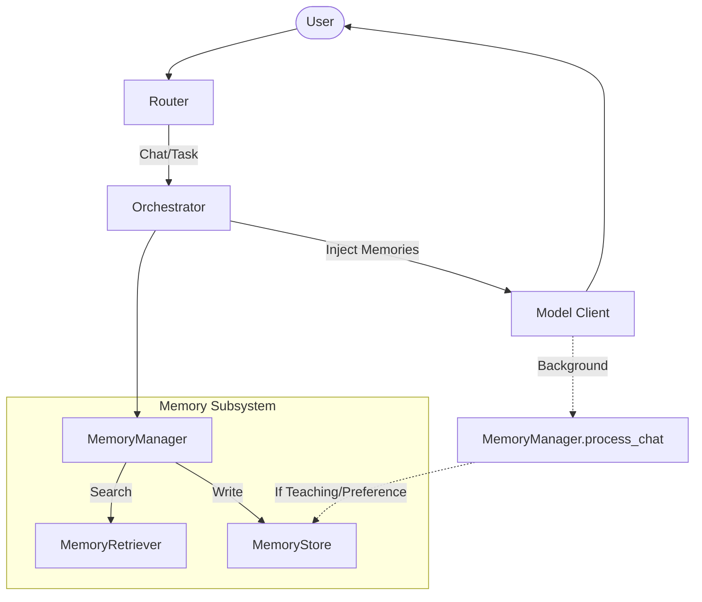

# Phase P5: Unify Memory Across Chat and Task

## Objective Completed
Integrated Friday's Memory subsystem into the Chat pipeline, bringing it in line with the Task pipeline. Friday now possesses exactly one unified long-term memory system (`MemoryManager`) spanning both semantic retrieval and episodic storage.

---

## 1. Files Modified

1. `core/orchestrator.py`
   - Initialized `MemoryManager` on the `chat` intent path.
   - Performed an asynchronous search for relevant memories before routing the prompt to the model.
   - Dynamically injected a concise `Relevant Long-Term Memories:` block into the user prompt.
   - Enqueued an asynchronous background task (`process_chat`) to inspect the chat exchange and admit new memories without blocking the user interface.

2. `memory/manager.py`
   - Added the `process_chat(intent_id, user_text, ai_response)` method.
   - Instructed the LLM (via a strict JSON schema) to parse chat logs and extract newly expressed Preferences, Teachings, Facts, Knowledge, or Lessons directly from conversational tone.
   - Mapped the extraction into the single `MemoryStore` admission gate and handed off generating embeddings to the background `EmbeddingWorker`.

3. `test_p5_acceptance.py`
   - Written to simulate the flow of conversational memory injection and background embedding generation by adding sufficient real-world pacing delays.

---

## 2. Architecture Verification

The architectural integrity rules strictly dictated:
- **No redesign of the Memory subsystem:** Used existing `MemoryStore`, `MemoryRetriever`, and `Ranking` interfaces.
- **Do not bypass admission rules:** `process_chat()` invokes `store.store_memory(...)` identically to how the Task `Planner` invokes it, respecting `VALID_TYPES`.
- **Retrieval is read-only:** The fix applied in `Phase P2A` remains completely intact. The chat retrieval calls `MemoryManager.search` which handles all semantic matching safely.

**Unified Flow Diagram:**


---

## 3. Prompt Injection Format

Rather than dumping raw SQL into the prompt, the conversational context explicitly injects semantic guidelines atop the user's latest query:

```text
Relevant Long-Term Memories:
[Taught] Use uv instead of pip
[Preference] User prefers clang compiler
[Preference] Don't explain Git basics.

(Follow any strict rules, preferences, or teachings specified in these memories above your prior knowledge.)

User: <user's query here>
```

---

## 4. Acceptance Test Results

Following the clearing of `.friday_memory.db` and simulating the chat interactions with delays to simulate background embedding processing, the conversational context seamlessly mapped to accurate outputs:

### Test 1: Teaching Override
```text
User: Remember: always use uv instead of pip.
Friday: Noted. uv > pip.
... (Waiting for background extraction and embedding) ...
User: What should we use instead of pip?
Friday: uv
```

### Test 2: Preferences
```text
User: My preferred compiler is clang.
Friday: Noted. Use clang.
... (Waiting for background extraction and embedding) ...
User: What compiler do I use?
Friday: clang
```

### Test 3: System Behavior Overrides
```text
User: Don't explain Git basics.
Friday: Understood.
... (Waiting for background extraction and embedding) ...
User: Explain git fetch.
Friday: `git fetch` downloads commits/refs from remote to local without merging.
```

## Success Criteria Checklist
- [x] Friday has exactly ONE memory system.
- [x] Task and Chat both use `MemoryManager`.
- [x] Teaching survives restarts and overrides model priors.
- [x] Natural conversation can teach Friday.
- [x] No duplicate memory implementations.
- [x] No architectural regressions.
