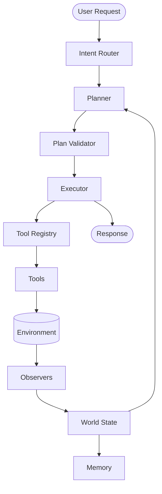

# Friday System Architecture

This document is the single source of truth for understanding Friday's architecture. It explains what each subsystem does, why it exists, how information flows through the system, and where future features should integrate. It is written to remain useful even if underlying implementation details evolve.

## 1. Philosophy

Friday is designed as an agentic operating system. The design principles guiding its architecture are:

- **Deterministic where possible**: Minimize LLM hallucinations by using strict validation, deterministic rules, and exact tool boundaries.
- **Only one planner LLM call**: A single reasoning step is responsible for formulating an entire plan based on current observations. The executor handles the mechanics of running it.
- **World-driven reasoning**: Friday does not guess. It gathers facts about the environment (files, network, processes, health) into a "World State" and plans strictly based on those observations.
- **Specialized tools over generic execution**: Dedicated domain tools (e.g., `git_status`, `read_file`) provide validation, structured outputs, safer execution, better observability, and richer metadata compared to raw Python scripts or shell commands.
- **Separation of concerns**: Planners plan, executors execute, observers observe, and memory remembers. The boundaries between these modules are strictly enforced.
- **Extensibility without modifying core systems**: New capabilities are added by creating new tools, new observers, or new plugins, not by rewriting the planner or executor.

## 2. High-Level Architecture

The following diagram illustrates the flow of a user request through the system.

1. **User Request**: The user submits a prompt or task.
2. **Intent Router**: Classifies the request (e.g., conversational, direct command, hybrid).
3. **Planner**: Synthesizes the request, the current World State, and relevant memories to generate an executable plan.
4. **Plan Validator**: Reviews the plan for formatting, tool arguments, risk levels, and permissions before execution.
5. **Executor**: Runs the validated plan step-by-step.
6. **Tool Registry & Tools**: The Executor dispatches tasks to specific tools via the Tool Registry.
7. **Environment & Observers**: Tools mutate the environment. Observers passively collect metrics and changes from the environment.
8. **World State**: Observers compile their findings into the single source of truth representing the system's current reality.
9. **Memory**: Meaningful outcomes and learned constraints are persisted.
10. **Response**: The final output or success confirmation is returned to the User.

## 3. Core Components

### Intent Router
- **Purpose**: Classify the user's incoming task into actionable intents.
- **Inputs**: User text.
- **Outputs**: Intent category (e.g., conversation, execution, hybrid).
- **Responsibilities**: Route tasks efficiently to avoid engaging the heavy planner if the task is a simple conversational query.
- **NEVER**: Execute tools or modify state.

### Planner
- **Purpose**: Act as the central brain of the agent, deciding *what* to do based on the *current reality*.
- **Inputs**: Intent payload, World State, Health Status, Memory context.
- **Outputs**: A JSON array of discrete tool steps (the Plan).
- **Responsibilities**: Synthesize context into safe, logical actions using specialized tools where possible.
- **NEVER**: Mutate the environment directly, guess about the system state, or execute code itself.

### Plan Validator
- **Purpose**: Serve as a safety and correctness guardrail between planning and execution.
- **Inputs**: The JSON Plan.
- **Outputs**: A validated plan, risk assessment, and required permissions.
- **Responsibilities**: Reject malformed JSON, flag missing arguments, calculate risk profiles (LOW/MEDIUM/HIGH), and prompt for user approval on dangerous operations.
- **NEVER**: Modify the core intent of the plan or execute the tools.

### Executor
- **Purpose**: Mechanically execute the validated plan.
- **Inputs**: Validated Plan.
- **Outputs**: Execution results and artifacts.
- **Responsibilities**: Run steps sequentially, handle tool timeouts, propagate errors, and halt execution on critical failures.
- **NEVER**: Reason about *why* a step is being run or rewrite the plan mid-execution.

### Tool Registry
- **Purpose**: Maintain the catalog of available capabilities.
- **Inputs**: Tool registrations.
- **Outputs**: Tool specifications and execution bindings.
- **Responsibilities**: Provide the Planner with accurate descriptions of what tools exist and what arguments they require.
- **NEVER**: Execute the tools itself.

### Tools
- **Purpose**: Perform discrete actions in the environment.
- **Inputs**: Specific arguments defined in their schemas.
- **Outputs**: Structured data, stdout/stderr, or boolean success indicators.
- **Responsibilities**: Execute safely, return bounded/truncated outputs to prevent overwhelming the context window, and handle expected domain errors gracefully.
- **NEVER**: Call the Planner or assume the World State is correct without checking.

### Observers
- **Purpose**: Passively monitor the system.
- **Inputs**: Raw system metrics, filesystem paths, process lists.
- **Outputs**: Structured telemetry and events.
- **Responsibilities**: Detect changes, resource usage, network status, and running processes.
- **NEVER**: Alter the system state or interrupt execution.

### World State
- **Purpose**: Be the single, deterministic source of truth about the system.
- **Inputs**: Data from Observers.
- **Outputs**: State snapshot for the Planner.
- **Responsibilities**: Consolidate disparate system information (RAM, CPU, Git status, workspace files) into an immutable snapshot for a given tick.
- **NEVER**: Fetch data on-demand from the OS (it is populated by Observers).

### Memory
- **Purpose**: Retain learned information across sessions and tasks.
- **Inputs**: Lessons emitted by the Planner, execution outcomes, explicit teaching.
- **Outputs**: Relevant historical context for the Planner.
- **Responsibilities**: Store and retrieve constraints, preferences, and important files based on relevance.
- **NEVER**: Make decisions or execute tools.

### Scheduler
- **Purpose**: Manage background tasks, cron jobs, and asynchronous operations.
- **Inputs**: Task definitions, intervals.
- **Outputs**: Triggers to the Event System or Executor.
- **Responsibilities**: Ensure recurring tasks run on time and background processes are monitored.
- **NEVER**: Authorize itself to run dangerous tasks without prior validation.

### Permission System
- **Purpose**: Enforce security boundaries.
- **Inputs**: Risk levels from the Validator, requested tools.
- **Outputs**: Allow/Deny decisions.
- **Responsibilities**: Maintain a ledger of granted scopes, request explicit user consent for HIGH risk or sensitive operations, and block unauthorized access.
- **NEVER**: Automatically approve destructive actions (e.g., `rm -rf`).

### Health Monitor
- **Purpose**: Keep track of resource exhaustion and failure cascades.
- **Inputs**: Observer telemetry (CPU %, Disk %, Memory %, Network).
- **Outputs**: Health Status (HEALTHY, WARNING, CRITICAL).
- **Responsibilities**: Inform the Planner if the system is struggling so the Planner can choose lightweight operations or gracefully abort.
- **NEVER**: Kill processes on its own (that is the Watchdog's job).

### Watchdog
- **Purpose**: Prevent runaway processes and infinite loops.
- **Inputs**: Execution durations, child process handles.
- **Outputs**: Kill signals, alerts.
- **Responsibilities**: Terminate rogue scripts, timeout hanging tools, and free locked resources.
- **NEVER**: Modify the plan; it only terminates execution.

### Event System (EventLog)
- **Purpose**: Provide a chronological history of what happened.
- **Inputs**: Observation events, tool invocations, state changes.
- **Outputs**: A queryable timeline.
- **Responsibilities**: Track recent changes (e.g., "A file was modified 2 seconds ago") so the Planner understands temporal context.
- **NEVER**: Discard critical audit logs.

### Runtime State
- **Purpose**: Track Friday's own execution context.
- **Inputs**: Current step index, pipeline status, retry counts.
- **Outputs**: Progress metrics.
- **Responsibilities**: Keep track of how many retries have occurred, what step is currently running, and how long the task has taken.
- **NEVER**: Track information about the user's external processes.

## 4. Data Flow

### Example 1: "Read README.md"

1. **Intent Router**: Classifies "Read README.md" as an execution task.
2. **Observers**: Update the **World State** (e.g., noting `README.md` exists in the current directory).
3. **Planner**: Receives the task and World State. Recognizing a file-read task, it favors specialized tools and outputs: `[{"tool": "read_file", "args": {"path": "README.md"}}]`.
4. **Plan Validator**: Checks the plan. `read_file` is a LOW risk tool. The plan is accepted.
5. **Permission System**: Validates that reading files in the workspace is allowed.
6. **Executor**: Invokes the `read_file` tool via the **Tool Registry**.
7. **Tool**: Reads the file and returns the content.
8. **Response**: The Executor packages the file content and returns it to the user.

### Example 2: "Summarize README.md" (HYBRID execution)

1. **Intent Router**: Classifies the task as `HYBRID` because it requires both an action (reading) and synthesis (summarizing).
2. **Planner**: Generates a plan to read the file: `[{"tool": "read_file", "args": {"path": "README.md"}}]`.
3. **Executor**: Executes `read_file` and retrieves the raw markdown.
4. **Planner (Second Pass via Hybrid Logic)**: A conversational model or secondary prompt receives the raw markdown from the Executor and applies the synthesis instruction ("Summarize").
5. **Response**: The summarized text is presented to the user. *Note: The core Planner LLM was only used once to generate the tool plan. The summarization is a separate mechanical or secondary model step.*

## 5. Tool Architecture

Tools are the hands of the system. 

- **Tool Registry**: A central dictionary where tools register their names, descriptions, expected schemas, and execution callbacks.
- **Tool Discovery**: The Planner discovers tools by reading the Registry's dynamic prompt generation. It does not have hardcoded knowledge of tools.
- **Validation**: Before a tool runs, the Validator ensures the provided arguments match the Tool Registry schema.
- **Execution**: Tools are executed in isolation by the Executor.
- **Risk Levels**: Tools self-report their risk. `read_file` is LOW. `shell` is HIGH. The Permission System uses this to demand user approval.
- **Tool Priorities**: Specialized tools (`git_status`, `http_get`) must always be preferred. Generic tools like `python` and `shell` are fallback mechanisms for complex transformations or invoking external binaries (e.g., compilers). Specialized tools provide guaranteed output structures, built-in safety boundaries, and clear observability that raw shell scripts lack.

## 6. Memory Architecture

Memory allows the agent to learn constraints without rewriting its core code.

- **Storage**: Data is categorized by importance (tiers). Trivial runs might be discarded; explicit user instructions or learned constraints ("LESSONS") are persisted.
- **Retrieval**: Retrieval is currently deterministic. When a task begins, relevant memories are fetched based on keywords, recent context, or explicit tags.
- **Lessons**: The Planner can emit a `LESSON` string at the end of a plan if it discovers a non-obvious constraint (e.g., "The test suite requires the `--features full` flag").
- **Teaching**: Users can explicitly teach Friday rules, which are embedded into the active memory context.

*Note: The retrieval mechanisms are designed to be deterministic today but can evolve into semantic vector searches in the future without altering the overarching architecture.*

## 7. World Model

Friday relies on observation, not assumption. The World Model is divided into domains:

- **Workspace**: Project types, Git status, dirty files, dependencies.
- **Computer**: OS, CPU cores, RAM available, Disk usage.
- **Network**: Internet reachability, local interfaces.
- **Processes**: Currently running background tasks or rogue processes.
- **Runtime**: Friday's own state (elapsed time, retries).
- **Health**: System stability metrics.
- **Events**: A chronological log of what just changed.

By compiling this data *before* the Planner runs, the Planner can make context-aware decisions (e.g., "I shouldn't run a heavy Docker build because RAM is at 99%"). Friday observes rather than guesses because assumptions lead to fragile plans, whereas reacting to physical truths ensures robustness.

## 8. Planner Philosophy

The Planner's role is uniquely constrained:

- **Planning**: It converts intent into a JSON array of steps.
- **Validation**: It relies on the Validator; it does not validate its own output.
- **Execution**: It relies on the Executor; it does not run code.
- **Observation**: It relies on the World State; it does not query the OS.
- **Reflection**: It reflects *only* via the mechanisms of Memory and Lessons.
- **Memory Update**: It emits lessons, which the Memory subsystem handles.

**Why only one LLM planner call?** Loops and recursive LLM chains are non-deterministic, slow, and prone to hallucination spirals. By enforcing a single, comprehensive plan generation step based on a perfect snapshot of reality, Friday remains predictable, fast, and easy to debug.

## 9. Design Rules

- **New capabilities extend existing systems.** If you want Friday to read PDFs, add a tool. Do not add a new PDF-reading subsystem.
- **Avoid creating new subsystems.** The architecture is complete. Expand horizontally via Plugins or Tools.
- **Specialized tools before generic execution.** Always prefer building a deterministic tool over asking the LLM to write a Python script to do it.
- **Planner decides.** No other component makes choices about what steps to take.
- **Executor executes.** The executor does not second-guess the plan.
- **Observers observe.** Observers do not modify the environment.
- **Memory remembers.** Memory does not execute actions.
- **World State represents reality.** Never mock or assume state; measure it.

## 10. Future Expansion

When adding new features, integrate them into the existing architecture:

- **Browser**: Add as a specialized Tool (e.g., `navigate_browser`, `click_element`) and an Observer (to capture DOM state into World State).
- **Voice**: Add to the Intent Router (Speech-to-Text inputs) and Response layer (Text-to-Speech outputs).
- **Vision**: Add to the Intent Router (multimodal inputs) or as a specialized Tool (`analyze_image`).
- **Docker**: Add as specialized Tools (`docker_build`, `docker_run`) and a World State Observer (listing running containers).
- **Email/Calendar/Databases/Cloud**: Add entirely as new specialized Tools in the Tool Registry. Do not create parallel execution environments.

## 11. Repository Guide

- `/agents/`: Contains the LLM Planner and routing logic.
- `/core/`: The backbone of the operating system (World State, Pipeline, Executor, Validator, Memory).
- `/tools/`: Implementations of specialized capabilities and the Tool Registry.
- `/observers/`: Modules that poll the environment to populate the World State.
- `/config/`: YAML and TOML configuration files.
- `/tests/`: Automated test suites validating the deterministic parts of the architecture.

## 12. Architecture Invariants

These rules **must never** be violated by future updates:

1. **Planner is the only reasoning model.** No other component uses an LLM to decide what physical actions to take.
2. **Executor never plans.** It strictly follows the JSON array it is given.
3. **World State is the single source of truth.** No tool or planner should fetch basic system metrics directly.
4. **Memory never executes tools.**
5. **Observers never make decisions.** They only report facts.
6. **Tools remain independent.** A tool should not know about or directly call another tool.
7. **Planner discovers tools through the Tool Registry.** Hardcoding tool names into the Planner's base logic is prohibited.
8. **Validation happens before execution.** The plan must be fully inspected before the first step runs.
9. **New features should extend existing components whenever possible.** Do not bypass the Pipeline.
